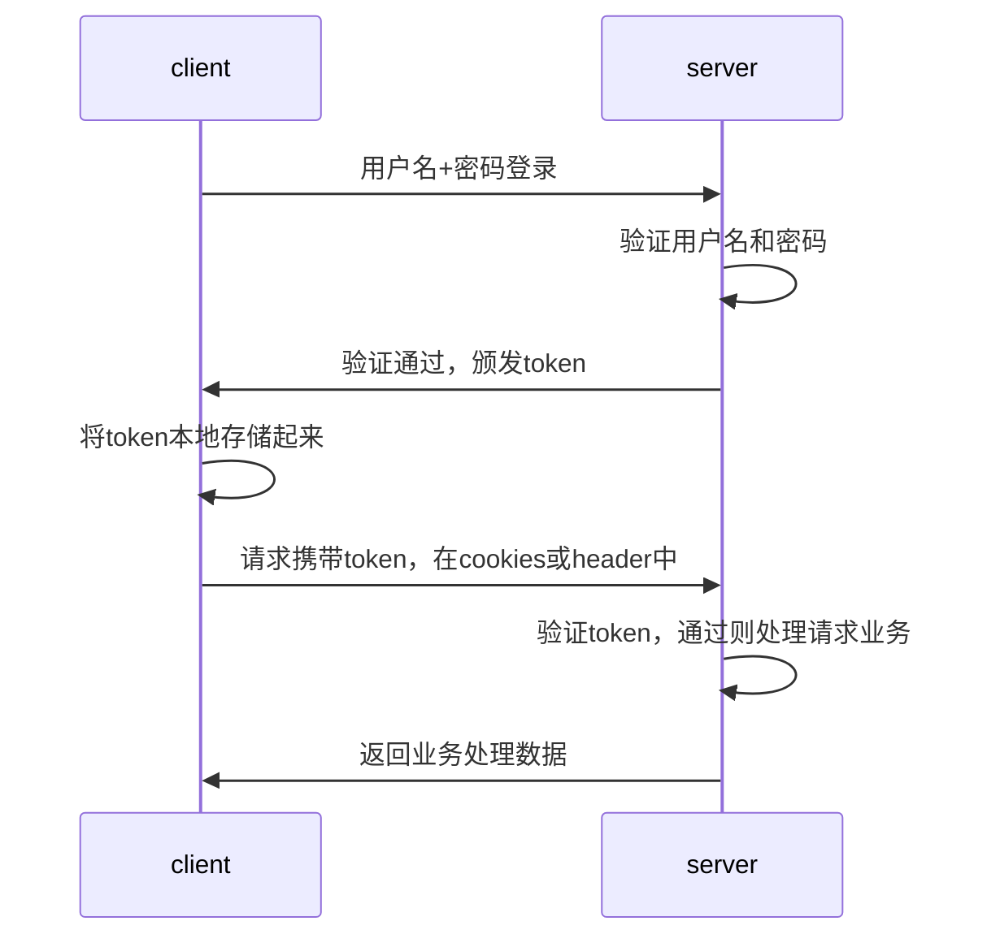

# 传统token进行身份验证的流程

```mermaid
sequenceDiagram
    client->>server: 用户名+密码登录
	server->>server: 验证用户名和密码
	server->>client: 验证通过，颁发token
	client->>client: 将token本地存储起来
	client->>server: 请求携带token，在cookies或header中
	server->>server: 验证token，通过则处理请求业务
	server->>client: 返回业务处理数据
```

# 什么是JWT
  
