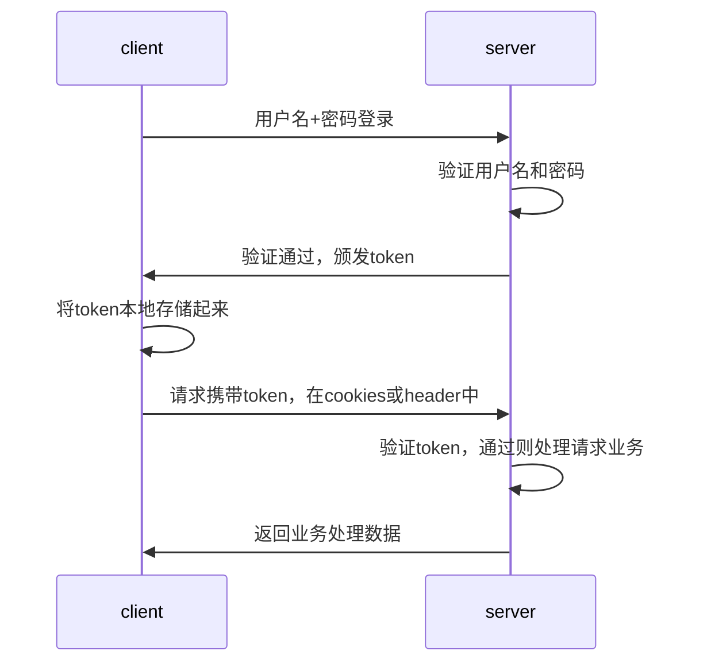
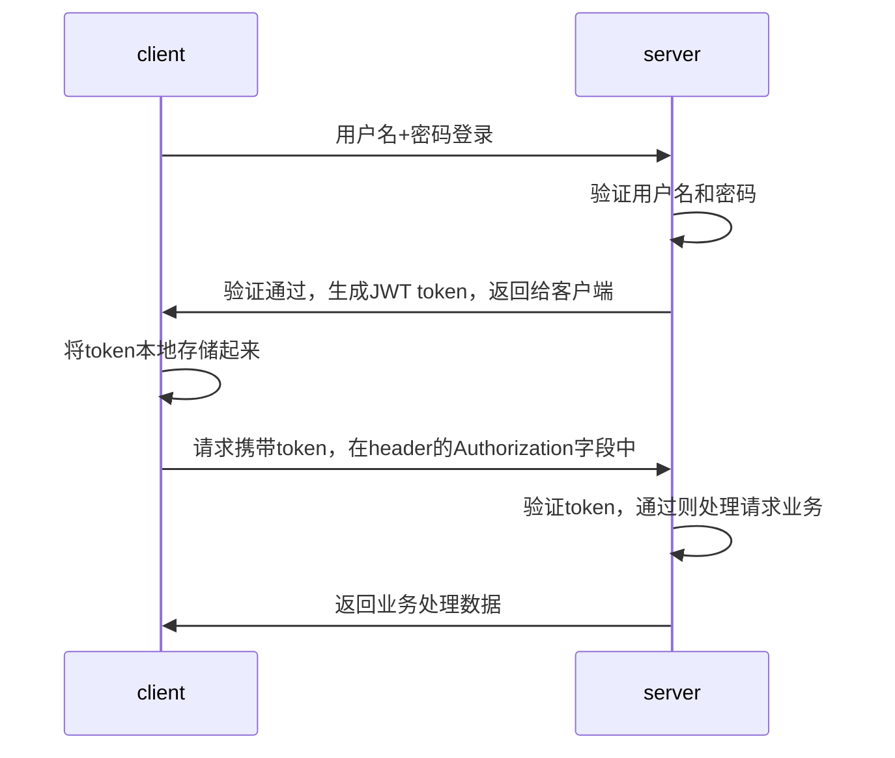

# token进行身份验证的流程

这种基于token的认证方式相对于session认证方式更加的节省服务器资源，并且对移动端更加友好。

优点：
1. 支持跨域访问。cookies是无法跨域的
2. 无状态。token机制在服务器端不需要存储session信息，因为token本身包含了所有的用户信息
3. 更适用于移动端
4. 无需考虑CSRF。

# 什么是JWT
  
[JWT](https://jwt.io/)是token机制的一种具体实现，其全称是：JSON Web Token

JWT本质是一个字符串，它将用户信息存储到JSON串中，然后对其编码得到一个token，并且这个JWT token带有签名信息，接收后可以校验是否有被篡改，所以这是一种安全的token认证方式。

JWT由三部分组成：标头（header）、负荷（Payload）、签名（Signature）。这三部分采用Base64分别对其编码后，再用`.`进行拼接成最后的token字符串

关于这三部分的含义，可以在JWT官网进行了解。[https://jwt.io/introduction](https://jwt.io/introduction)

# JWT 认证流程

1. 客户端通过表单登录，一般是post请求
2. 服务端接收到登录请求后，将包含用户信息的数据作为JWT的payload，将其与JWT header分别进行Base 64编码后拼接签名，形成一个JWT token
3. 服务端将生成的JWT token返回给客户端，客户端将其存储在本地，在后续接口请求中将JWT token放到header的Authorization字段中即可（该方式可以解决XSS和XSRF问题）；在用户退出登录时，将本地的JWT token同步删除
4. 客户端在访问业务接口时，携带JWT token，服务端在收到请求时先对进行签名的有效性检查。包括：签名是否正确、签名是否过期、token的接收方是否是自己等等
5. 验证通过后，服务端将JWT token中的用户信息解析出来，并放到上下文信息中；再进行其他的业务操作

